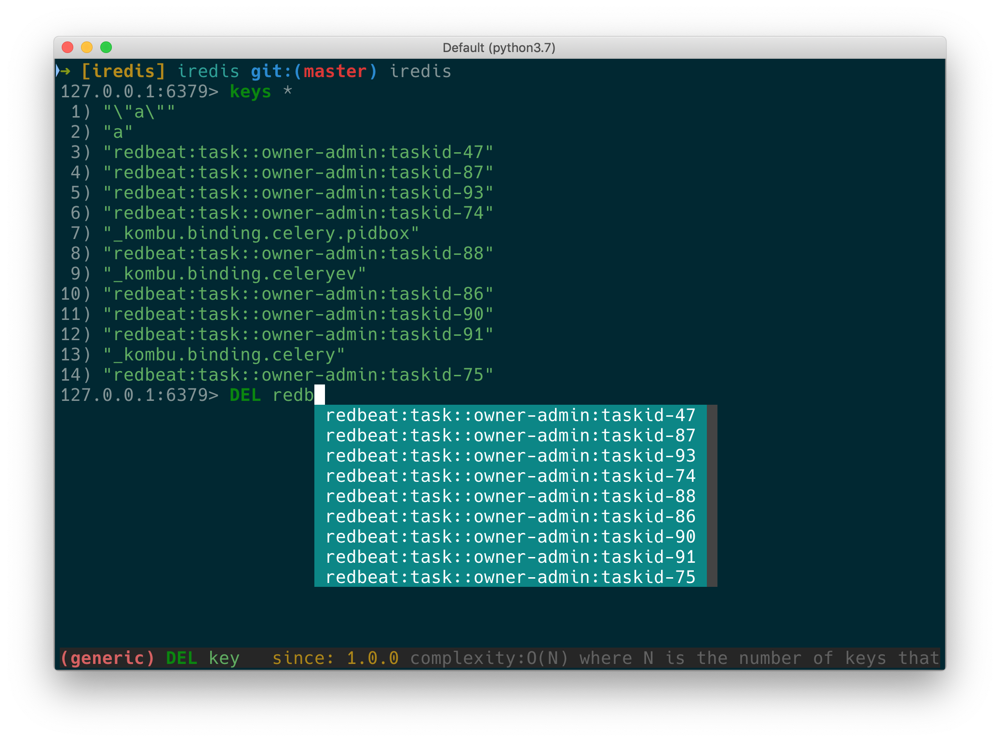
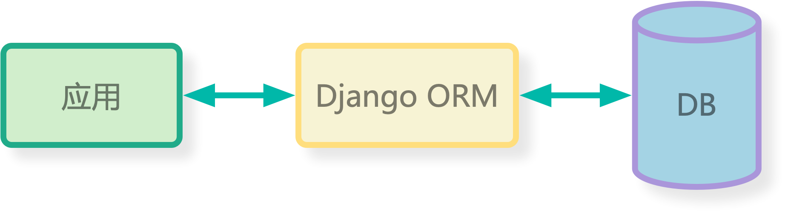

## Django Migrations Under the Hood

### By laixintao

---

## 关于我


- 《捕蛇者说》FM(@laike9m @Manjusaka @Adam)
- 《Python并行编程》翻译（还没完成）
- pingtop, git-ext, iredis, etc.
- 从2016年开始写 Python (Django1.8)



+++

## 第一个 Django 项目

- 一个人完成开发、部署、前后端；
- 包括注册登录、活动发布、报名付款，通知；
- 仍在线上运行（3年）；

+++

## 但是...
### 其实我不会SQL...

+++

- `python manage.py makemigrations` & `python manage.py migrate` for DDL
- `python manage.py shell` for query and DML

+++

## 这就是 Django ！

> The web framework for perfectionists with deadlines.

---?color=#ffcfdf

## Table of Contents

- 👉 Django Migraiton 的功能
- 工作原理
- 用法和常见问题
- Django 的选择

+++

## Migration 是做什么的？

1. Django 负责 CURD
2. 数据存储在 MySQL（或者其他SQL数据库中）
3. Django ORM 负责数据库的 Table 和 Python Class 对应

+++



```python
class Person(models.Model):
    name = models.CharField(max_length=64)
    age = models.IntegerField()
```

映射到...

```SQL
mysql root@localhost:django_example> describe app1_person;
+-------+-------------+------+-----+---------+----------------+
| Field | Type        | Null | Key | Default | Extra          |
+-------+-------------+------+-----+---------+----------------+
| id    | int(11)     | NO   | PRI | <null>  | auto_increment |
| name  | varchar(64) | NO   |     | <null>  |                |
+-------+-------------+------+-----+---------+----------------+
```

+++

### 为什么需要 migrations？

- 如果没有数据库结构迁移机制的话，需要手动在代码和表结构之间同步；
- 团队协作会很混乱；
- 多个环境部署会很混乱；
- 手动变更难以追踪；

+++

### Django migrations 帮助你

- 自动生成对应的表结构；
- 记录每一次变更，内置的回滚方案；
- “声明式”，可以被重复执行，结果幂等（这意味着解决了多环境的问题）；

---

## Table of Contents

- Django Migraiton 的功能
- 👉 工作原理
- 用法和常见问题
- Django 的选择

+++

### Django migrations 是如何工作的？


## So what is migration, exactly?

- foo
- foo
- foo


---?color=#ffcfdf

## Table of Contents

- What is migrations?
- 👉 How does it work?
- Pros and Cons(Compare to other sulotions)
- FAQs about django's migrations


---?color=#ffcfdf

## Table of Contents

- What is migrations?
- How does it work?
- 👉 Pros and Cons(Compare to other sulotions)
- FAQs about django's migrations

+++

## Some Anti-SQL voice

- Defining your schema in your ORM is nuts because it ties you to one language, reduces clarity, and sometimes limits SQL features you can use
- Existing migration tools don't pull their weight
- SQL is a more general skill than ORMs and other tools should therefore mirror SQL
- Mirroring live databases to get a schema is insane because are you tunneling to prod to run your linter? Live DB shouldn't be available to developers. Source of truth should be git.
- Schema should be versioned using the same git shas as code so the logic is easy to detect if a deploy requires a migration

footnote : "<a href='https://github.com/abe-winter/automigrate#philosophy'>automigrate project</a>"

---?color=#ffcfdf

+++

> Exactly this, I tend to write plain SQL nowadays since you eventually have to work around some ORM specific problems in the end. 

-- https://lobste.rs/s/ihqxej/orms_are_backwards#c_0x76xn

## Table of Contents

- What is migrations?
- How does it work?
- Pros and Cons(Compare to other sulotions)
- 👉 FAQs about django's migrations

---?color=#fefdca

# Thanks!
