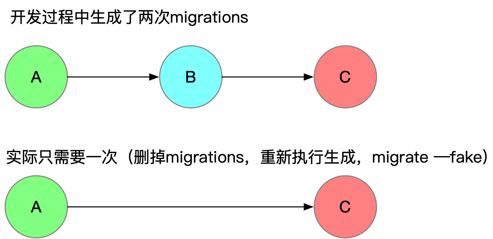

## Django Migrations Under the Hood

### By laixintao

---

## 关于我


- 《捕蛇者说》FM(@laike9m @Manjusaka @Adam)
- 《Python并行编程》翻译（还没完成）
- pingtop, git-ext, iredis, etc.
- 从2016年开始写 Python (Django1.8)


+++

## 第一个 Django 项目

- 一个人完成开发、部署、前后端；
- 包括注册登录、活动发布、报名付款，通知；
- 仍在线上运行（3年）；

+++

## 但是...
### 其实我不会SQL...

+++

- `python manage.py makemigrations` & `python manage.py migrate` for DDL
- `python manage.py shell` for query and DML

+++

## 这就是 Django ！

> The web framework for perfectionists with deadlines.

---?color=#ffcfdf

## Table of Contents

- 👉 Django Migraiton 的功能
- 工作原理
- 用法和常见问题
- Django 的选择

+++

## Migration 是做什么的？

1. Django 负责 CURD
2. 数据存储在 MySQL（或者其他SQL数据库中）
3. Django ORM 负责数据库的 Table 和 Python Class 对应
4. Migrations 就是数据库结构的 Version Control System！

+++


```python
class Person(models.Model):
    name = models.CharField(max_length=64)
    age = models.IntegerField()
```

映射到...

```SQL
mysql root@localhost:django_example> describe app1_person;
+-------+-------------+------+-----+---------+----------------+
| Field | Type        | Null | Key | Default | Extra          |
+-------+-------------+------+-----+---------+----------------+
| id    | int(11)     | NO   | PRI | <null>  | auto_increment |
| name  | varchar(64) | NO   |     | <null>  |                |
+-------+-------------+------+-----+---------+----------------+
```

+++

### 为什么需要 migrations？

- 如果没有数据库结构迁移机制的话，需要手动在代码和表结构之间同步；
- 团队协作会很混乱；
- 多个环境部署会很混乱；
- 手动变更难以追踪；

+++

### Django migrations 帮助你

- 自动生成对应的表结构；
- 记录每一次变更，内置的回滚方案；
- “声明式”，可以被重复执行，结果幂等（这意味着解决了多环境的问题）；

---?color=#ffcfdf

## Table of Contents

- Django Migraiton 的功能
- 👉 工作原理
- 用法和常见问题
- Django 的选择

+++

### Django migrations 是如何工作的？

1. 自动生成每一次的数据库变更；
2. 执行数据库变更；

+++

### 重复执行没有副作用

```
$ python manage.py makemigrations
No changes detected
```

+++?color=#ffffff

## 生成变更

```
$ python manage.py makemigrations
```


+++

### 步骤

1. 应用历史的变更，得到上次最新的结构 A；
2. 对比当前的 Model B；
3. 生成从 A 状态迁移到 B 状态的变更;

+++

- 这步不需要连接数据库；
- O(n) 操作，如果历史的 migrations 很多了，耗时会很长；
- 不能有歧义;

+++

把这个过程想象成上帝在看着你下棋。

但是他不会记住每一步，

每当你 makemigrations 的时候，

他会记下来怎么把上次的棋盘变成现在的样子。


+++

### 歧义


+++

a -> b ?

a -> c ?

```
Did you rename person.inta to person.intc (a IntegerField)? [y/N] N
Did you rename person.intb to person.intc (a IntegerField)? [y/N] y
Did you rename person.inta to person.intd (a IntegerField)? [y/N] N
```

+++

## 执行变更

```
$ python manage.py migrate
```

+++

### 重复执行不会带来副作用

```
$ python manage.py migrate
Running migrations:
  No migrations to apply.
```

+++

### migrate 做了什么？

- 真正引起数据库结构改变的操作；
- 将 migration files 翻译成 SQL 并执行；
- 记录 migrate 执行到哪一次了;

```Python
  File: app1/migrations/0006_auto_20190912_1150.py
  # Generated by Django 2.2.5 on 2019-09-12 11:50

  from django.db import migrations, models


  class Migration(migrations.Migration):

      dependencies = [
          ('app1', '0005_auto_20190912_1149'),
      ]

      operations = [
          migrations.RenameField(
              model_name='person',
              old_name='intb',
              new_name='intc',
          ),
          migrations.RemoveField(
              model_name='person',
              name='inta',
          ),
          migrations.AddField(
              model_name='person',
              name='intd',
              field=models.IntegerField(default=None),
              preserve_default=False,
          ),
      ]
```

+++

### 如何防止 SQL 重复执行？

```SQL
mysql root@localhost:django_example> SELECT * FROM django_migrations LIMIT 3;
+----+--------------+--------------+----------------------------+
| id | app          | name         | applied                    |
+----+--------------+--------------+----------------------------+
| 1  | contenttypes | 0001_initial | 2019-09-08 09:08:51.254479 |
| 2  | auth         | 0001_initial | 2019-09-08 09:08:51.355292 |
| 3  | admin        | 0001_initial | 2019-09-08 09:08:51.544356 |
+----+--------------+--------------+----------------------------+
```

+++

### unapply 功能

```Python
➜ python manage.py migrate app1 0001
Operations to perform:
  Target specific migration: 0001_initial, from app1
Running migrations:
  Rendering model states... DONE
  Unapplying app1.0003_remove_person_intc... OK
  Unapplying app1.0002_remove_person_intn... OK
➜ python manage.py migrate app1 0002
Operations to perform:
  Target specific migration: 0002_remove_person_intn, from app1
Running migrations:
  Applying app1.0002_remove_person_intn... OK
```

+++

### 总结

1. Django 用之前的 migrations 文件作为上一个状态的 source of truth，和当前
状态作对比，得到 diff 生成新的 migrations；
2. Django 在数据库中用一张表记录哪些 migrations 被执行过了，防止重复执行；

---?color=#ffcfdf

## Table of Contents

- Django Migraiton 的功能
- 工作原理
- 👉 用法和常见问题
- Django 的选择

+++

## FAQ1

> 将 migrate 加入到启动命令中?

既然 migrate 是幂等的，我把这个操作放到 Docker 的 CMD
中，每次启动之前自动应用新的变更（如果有）.

What cloud go wrong?

+++

# DON'T DO THAT!

+++

# Why?

1. 多台机器同时启动可能损坏表结构；
2. 默认当前的数据结构只会被当前的代码使用；
(灰度？回滚？都不可行了）

+++

## 最佳实践

1. 用一个单独的 Docker image 来做 migrate；
2. migrate 要向后兼容（这是另一个故事了）

+++

## FAQ2

> migrate 执行失败

为什么会发生？

因为 `makemigrations` 的时候并没有连接数据库，是基于逻辑生成的。真正执行的时候可能失败。

+++

### 如何恢复？

1. 复原已经执行过的操作；
2. 删除 `django_migrations` 记录；
3. 修复 migrations 文件；
4. 重新执行。

+++

## FAQ3

> 为什么我没有改动任何 Models，但是每次 `makemigrations` 都会生成新的？

+++

### 还记得 migrations 是怎么生成的吗？


+++

Model 和 Migrations 结果对比每次都有 diff：

- 代码中是不是用了结果不确定的数据结构？（比如 Python3.5 之前的 dict）
- 代码中是否有代码每次执行的结果是不确定的？

+++

## FAQ4

> 我和同事在不同的分支生成了 000N 相同的 migrations 怎么办？

+++

```python
$ python manage.py makemigrations --merge
```

+++

## FAQ5

> migrations 执行太慢了

+++

### 重建 migrations

> 因为 migrations 记录了所有的变更，如果这些变更在一段时间之后对我们不再重要，我们可以把当前的Model状态作为 0001 。

+++

### 步骤

1. 备份数据库和整个项目；
2. `ls */migrations/*.py | grep -v __init__ | xargs rm` 删除历史 migrations
3. 重新 `makemigrations`
4. 删除 `django_migrations` 记录；
5. `python manage.py migrate --fake` 填充 `django_migrations` 数据；

+++

## FAQ6

> 是否应该将生成的 migrations 文件追踪到 git 中？

是的。

+++

### 提交之前进行检查



+++

### 💡 尽量让 migrations 有意义，像 git commit message 那样。

+++

## FAQ7

> 不要害怕自己写 migrations

+++

当你想：

1. 你的 Model 变化太复杂，想要自己写 Migrations 的时候；
2. 在 migrate 结构的同时，有一些数据需要变化的时候；

+++

用 `python manage.py makemigrations --empty` 生成一个空的，
然后自己写。

+++

RunPython & RunSQL are you friends!

```Python

def my_editor(app, schema_editor):
    Person = app.get_model("app1", "Person")
    schema_editor.remove_field(Person, "age")


class Migration(migrations.Migration):

    dependencies = [("app1", "0001_initial")]

    operations = [migrations.RunPython(my_editor)]
```

+++

### 几点要注意的事情

1. `app.get_model`;
2. 不要在 RunSQL 里面记录表结构变更;

---?color=#ffcfdf

## Table of Contents

- Django Migraiton 的功能
- 工作原理
- 用法和常见问题
- 👉 Django 的选择

+++

Django 的 migration 设计：

1. migrations 记录每一次变更；
2. 数据库一张meta表记录变更的执行情况；

+++

## Before Django Migrations

### Django-South

+++

- Django1.6 只支持创建表, 修改Model只能自己去修改表；
- Migrations 方案混杂，几年之后，South 成为事实标准；
- South 遇到了自己的瓶颈, Andrew 希望将migrations加入到 Django core 中，完全替代South;
- 第一个 [Pull Request](https://github.com/django/django/pull/376) 漫长而复杂(~7k changes)，这项工作将漫长而困难;
- Andrew 发起[众筹](https://www.kickstarter.com/projects/andrewgodwin/schema-migrations-for-django)，希望每周投入80小时到这项工作中；
- 众筹发起1小时完成了目标，4小时筹集 $7000；
- Django1.7 开始支持migrations 🎉

+++

### Django-South

```Python
  class Migration(SchemaMigration):

      def forwards(self, orm):
          # Adding field 'Knight.name'
          db.add_column('app1_knight', 'name',
                        self.gf('django.db.models.fields.CharField')(default='', max_length=100),
                        keep_default=False)


      def backwards(self, orm):
          # Deleting field 'Knight.name'
          db.delete_column('app1_knight', 'name')


      models = {
          'app1.knight': {
              'Meta': {'object_name': 'Knight'},
              'dances_whenever_able': ('django.db.models.fields.BooleanField', [], {'default': 'False'}),
              'id': ('django.db.models.fields.AutoField', [], {'primary_key': 'True'}),
              'name': ('django.db.models.fields.CharField', [], {'max_length': '100'}),
              'of_the_round_table': ('django.db.models.fields.BooleanField', [], {'default': 'False'})
          }
      }

      complete_apps = ['app1']
```

+++

### Django Migrations vs Django-South

- Django migrations 没有写 backwards
- Django migrations 没有 models，需要从第一个migrations开始依赖，South 只依赖前一个

Django migrations 对开发者更友好，South 冗余信息跟多，速度更快

+++

Django 这样的设计给我们什么？

1. Model 的 source of truth;
2. 变更历史记录;
3. 但是没有隐藏所有的事情，migrations 可以被人为干涉；
4. 方便人工编辑;

+++

## 我们来看一下其他的方案

+++

### 没有 migrations

- 直接对比代码中的 Model 和数据库的 Table
- 消除 diff

### 缺点

- 迁移过程不透明，不可控制

+++

## 有 migrate 表但是不记录 migrations

+++

## automigrate

https://github.com/abe-winter/automigrate

+++

## 一些反对 ORM 的声音

- ORM 引入了新的理解成本，大家已经都熟悉SQL了；
- ORM 并没有屏蔽所有的问题，会遇到只能写SQL才能解决；
- 增加了解决问题的复杂性，和了解事实的复杂性；

+++

> Exactly this, I tend to write plain SQL nowadays since you eventually have to work around some ORM specific problems in the end. 

https://lobste.rs/s/ihqxej/orms_are_backwards#c_0x76xn


---?color=#fefdca

# Thanks!

- Blog: https://www.kawabangga.com/
- Slide 地址： https://github.com/laixintao/django-migrations-under-the-hood
